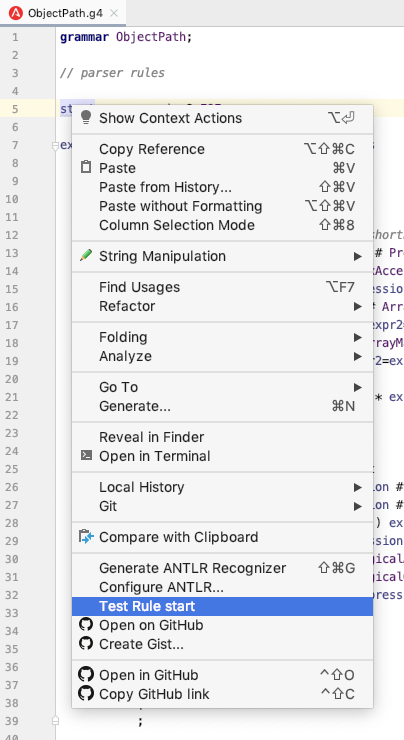

# Development

ANTLR4 grammar is used to formally describe the syntax and to generate string-to-AST parser. AST visitor is written manually, but in a consistent code style across languages. This is to enable easy porting into new target language.

**Directories**

- `grammar` - ANTLR4 grammar
- `objectpath-*` - language-specific implementation, with directory structure and package definition following langauage standards
  - `parser` - generated ANTLR4 string-to-AST parser
  - `visitor` - AST visitor and custom visitor functions
  - `GetByPath.*` - entry point to the library, contains main function `getByPath`
- `test` - test usecases

**Dependencies**

Dependencies for each language-specific implementation are managed by their respective package manager tools.

- `objectpath-ts` - npm
- `objectpath-java` - Maven

*(optional)* For direct CLI access to ANTLR4 compiler, download [Complete ANTLR Java binaries jar (antlr-x.y.z-complete.jar)](http://www.antlr.org/download.html). Useful aliases:

```
alias antlr4='java -cp ".:/usr/local/lib/antlr-x.y.z-complete.jar:$CLASSPATH" org.antlr.v4.Tool'
alias grun='java -cp ".:/usr/local/lib/antlr-x.y.z-complete.jar:$CLASSPATH" org.antlr.v4.gui.TestRig'
```

**Updating ANTLR4 grammar, parser**

When updating ANTLR4 grammar, run `./generate-parser.sh` to generate parsers in all target languages. **Don't edit parsers manually!** Then update AST visitors in each language respectively.

For visualizing AST, ANTLR IntelliJ plugin is recommended. Open `grammar/ObjectPath.g4`, right-click `start` rule, select "Test ANTLR rule", enter the input string into the left window, observe parse tree in the right window.




*The other option is `grun` tool. But it doesn't support grammar file and compiled Java files in separate directories, you'd need to disable `-package` option and output the parser to the same directory with grammar in `objectpath-java/generate-parser.sh`.*

**Updating AST visitor**

When updating AST visitor (`GetByPath.*`, `GetByPathVisitor.*`, `GetByPathVisitorFunctions.*`), keep them as close as possible in all languages. Although this might lead to code that is not idiomatic to the given language, it allows straightforward porting of new features.